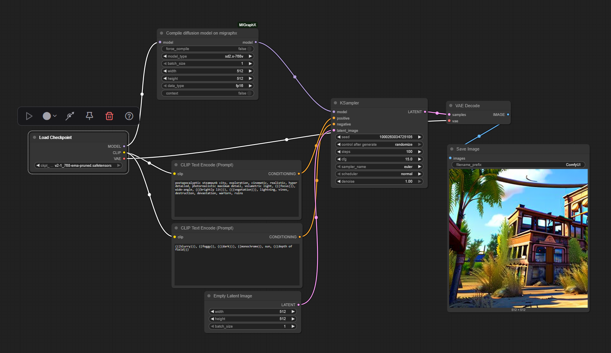

# MIGraphX Node for ComfyUI

This node enables better performance for Stable Diffusion models, by leveraging AMD MIGraphX, on Navi3 and Navi4 GPUs.

Supports:

* Stable Diffusion 3.0
* Other models to be supported...

## Installing

#### Dependencies
To run node with MIGraphX support install:
* [ROCm](https://rocm.docs.amd.com/projects/install-on-linux/en/latest/) 
* [PyTorch with ROCm support](https://rocm.docs.amd.com/projects/install-on-linux/en/latest/install/3rd-party/pytorch-install.html)
* MIGraphX:
```bash
sudo apt install migraphx
```

#### Install node
To manually install clone this repo to ComfyUI/custom_nodes folder:
```bash
cd custom_nodes
git clone https://github.com/pnikolic-amd/ComfyUI_MIGraphX.git
pip install -r requirements.txt
#for best performance
export MIGRAPHX_MLIR_USE_SPECIFIC_OPS="attention"
```

## Instructions
You can find different workflows in the [workflows](./workflows/) directory. They can be loaded in ComfyUI.

#### Create workflow with MIGraphX support
To add MIGraphX node go to toolbar/node library/advanced/migraphx and select "Compile SD3 model on migraphx" node. Connect input model to "Load Checkpoint" node and connect output model to "KSampler" or some other node. Params:
* batch_size, height, width - set same as in Latent image node (testd with 512x512 and 1024x1024).
* context_len - 77 if t5 is not used, 154 if t5 is used.
* data_type - data type that models uses (fp16 for model in example).

